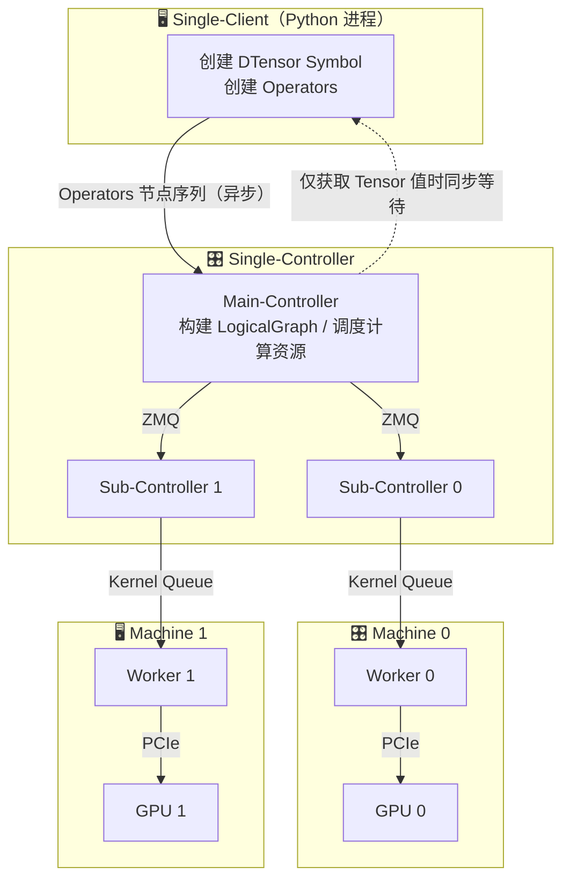
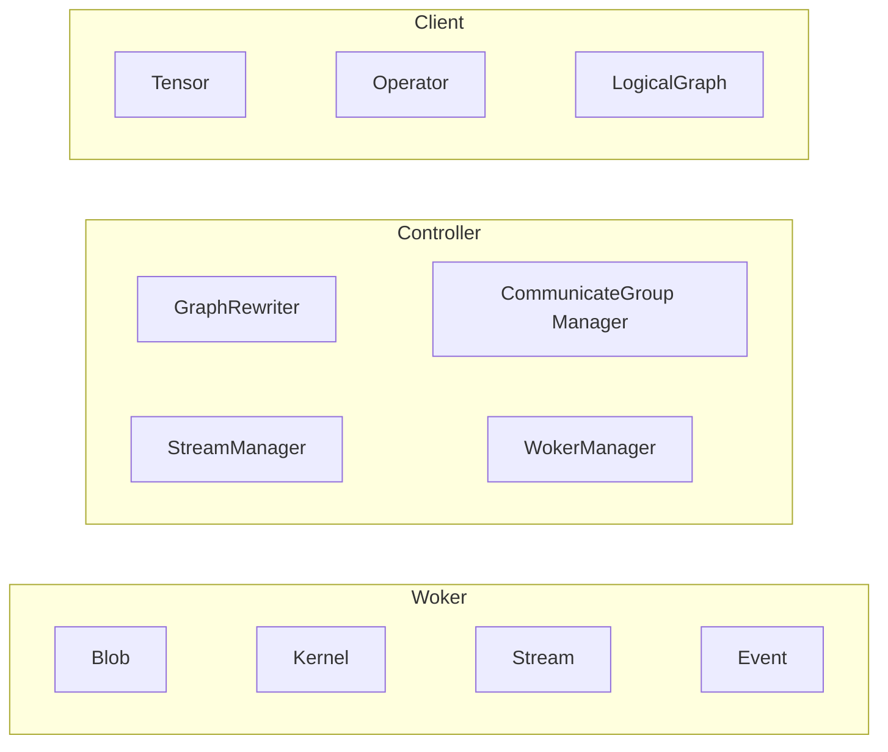

# 设计理念

DTorch 采用 Single-Controller 架构，通过跨机网络传输控制分布式 GPU 集群。相比之下，Multi-Controller 架构中存在多个 Controller，各自仅需经过 PCIe 总线控制本机 GPU，因此 Single-Controller 的调度开销高于 Multi-Controller，但换来了全局视图和更简洁的编程模型。

深度学习程序通常由一系列 Tensor 和 Operator 组成，输入/输出 Tensor 的数据类型、Shape 等信息在 Operator 执行计算前即可确定。仅在极少数情况下（如 [torch.nonzero](https://docs.pytorch.org/docs/stable/generated/torch.nonzero.html) 和 [torch.Tensor.item](https://docs.pytorch.org/docs/stable/generated/torch.Tensor.item.html) 等）才需要基于输出 Tensor 的值进行分支跳转。基于这一特点，DTorch 可以提前构造由 Tensor 和 Operator 组成的计算图，从而降低调度与运行开销，提升程序性能。

DTorch 基于上述特点，围绕三大核心架构构建了一套简洁且高效的深度学习 API：

1. **Single-Client Single-Controller Multi-Worker** — 异步分布式执行模型
2. **Distributed Tensor** — 原生多维分布式张量抽象
3. **Eager Graph Architecture** — 融合 Eager Mode 与 Graph Mode 优势的执行引擎

## Single-Client Single-Controller Multi-Worker

用户使用 DTorch API 时，在单线程的 Python 代码中使用 DTensor 描述计算节点（创建 Tensor、调用 Operator），框架自动完成分布式集群上的资源管理、任务分发和通讯等操作。DTorch 中包含三类角色：Client、Controller 和 Worker，构成 Single-Client Single-Controller Multi-Worker 的架构：

> 图中实线箭头表示异步消息流，虚线箭头表示同步等待（仅在获取 Tensor 值时触发）。

**Single-Client** 即 Python Client。用户在 Python Client 中创建 Tensor、调用 Operator 和获取 Tensor 的值。Python Client 上的所有操作都被抽象为”计算节点”，并序列化为 Messages 异步发送给 Controller。Python Client **不直接**创建 CUDA Memory 或调用 CUDA Kernel 执行计算。Client 侧的 Tensor 仅仅是一个 Symbol，持有 Shape、DType、DeviceMesh 和 Placements 等元信息，但不持有数据指针。当执行计算如 `tensor_c = tensor_a + tensor_b` 时，Python Client 根据输入 Tensor 的 Shape、DeviceMesh 等元信息即可直接推断出输出 Tensor 的 Shape、DeviceMesh 等信息。

> **Client 与 Controller 异步执行**，绝大多数情况下 Python Client 无需等待 Controller 即可完成所有计算节点的创建，这极大地降低了分布式系统中的通讯开销。仅当 Python Client 需要根据 Tensor 的值决定后续代码分支时，才需等待 Controller 返回计算结果。DTorch 还提供 Tensor Future 机制，允许异步获取 Tensor 的值，避免主线程阻塞。

**Single-Controller** 负责管理全部计算资源，核心实现位于 `dtorch/core/distributed/main_node.h` 和 `dtorch/core/graph/eager_graph_executor.h`。它接收 Client 发送的计算节点 Messages，将其转换为计算图（LogicalGraph），并基于此完成：Tensor 创建与释放、CUDA Kernel 创建与调度、CUDA Stream 创建与同步、Communicate Group 管理等。在分布式集群中，有且仅有一个 Main-Controller 运行在主节点上；每台机器上有一个 Sub-Controller（`dtorch/core/distributed/worker_node.h`），负责与 Main-Controller 通讯并根据指令直接管理本机资源。Controller 将计算节点翻译为可执行的 Kernel，分发给 Worker 执行。

> **Controller 与 Worker 同样异步执行**，仅当获取 Tensor 的值时才需同步。

**Multi-Worker** 负责执行计算任务。每个 Worker 是一个 C++ Thread，GPU Worker 则额外持有一个 CUDA Stream。Worker 按序执行 Controller 发来的 Kernel，完成计算任务。一块 GPU 可同时对应多个计算 Worker 与通讯 Worker，实现计算与通讯的重叠。Tensor 可被同机不同 Worker 并发访问，Controller 会自动插入必要的同步节点（CUDA Event），避免 Multi-Thread Race Condition。

## Distributed Tensor

**DTorch 原生支持 DTensor，并基于 DTensor 构建了完善且易用的分布式 API。**PyTorch 中虽也支持 DTensor，但至今仍处于 [alpha 阶段](https://docs.pytorch.org/docs/stable/distributed.tensor.html)。DTorch 中的 DTensor 通过 `DeviceMesh`（`dtorch/api/cpp/distributed_spec.h`）和 `Placement`（Replicate、Shard、Partial）表示 N-D 并行，支持目前所有主流并行范式：Data Parallel、Tensor Parallel、Context Parallel、Pipeline Parallel、Expert Parallel 和 ZeRO。

相比 PyTorch SPMD 风格的 Tensor，使用 DTensor 无需手动切分或聚合各设备上的 Tensor，代码更简洁且符合直觉。例如使用 PyTorch SPMD 实现 Tensor Parallel 时，需显式切分 Linear 的权重；在计算过程中需要获取 Tensor 值时，还必须手动调用 `all-gather` 等集合通讯算子，代码极易出错。

### 计算

DTorch 支持直接创建 DTensor（提供 `randn`、`ones`、`empty` 等创建接口），且**所有 Operator 均原生支持 DTensor**，与单机 Tensor 一样直接调用即可。每个 Operator 定义一组 `PlacementSignature`（`dtorch/core/operators/placement_signature.h`），描述输入输出 Placement 的对应关系。框架根据 PlacementSignature 及其他规则，基于输入 Tensor 的 DeviceMesh 和 Placements 自动推导输出 Tensor 的 DeviceMesh 和 Placements。

当 DeviceMesh 或 Placements 无法匹配时，需插入 `tensor.redistribute()` 操作。由于此操作通常耗时较大，DTorch 默认不自动执行，而是报错提示用户修改代码。为便于使用，某些常用算子会自动插入 `tensor.redistribute()`，这些算子会在文档中单独说明，例如：
- Shard Tensor 与 Replicate Tensor 相加
- Shard Tensor 调用 `tensor.sum()`
- Scale Dot Product Attention 支持 Ulysses 和 Ring Context Parallel

### 通讯

DTorch 通过 `tensor.redistribute()` 函数改变 Tensor 的 DeviceMesh 和 Placements。用户无需显式创建并管理 [ProcessGroup](https://docs.pytorch.org/docs/stable/distributed.html#torch.distributed.init_process_group)，也无需调用 [all_reduce](https://docs.pytorch.org/docs/stable/distributed.html#torch.distributed.all_reduce) 等集合通讯算子。DTorch 中的 DeviceMesh 仅表示一组 Device ID，框架在底层（`dtorch/core/communication/`）自动创建和管理对应的 ProcessGroup。

不同于 PyTorch 中通讯需通过 ProcessGroup 隐式绑定某个 CUDA Stream，`tensor.redistribute()` 本身是一个普通算子，因此 DTorch 底层可根据计算图和网络拓扑选择最高效的实现，并自动实现计算与通讯的重叠 — 在保证接口易用的同时获得更好性能。

DTorch 还支持 DTensor 的**不均匀切分**，在 `tensor.redistribute()` 时自动补 padding 和移除 padding（NCCL 中部分集合通讯 primitive 要求所有 rank 上输入 Tensor 的 shape 完全一致）。

### 并行方案

DTorch 的 DTensor 支持目前所有主流并行方式，各并行方案的实现方式各有不同：
- **Data Parallel / Pipeline Parallel**：使用正确的 DeviceMesh 和 Placements 即可自动实现
- **Tensor Parallel**：提供 CPTPLinear 和 CPTPEmbedding module 方便调用
- **Context Parallel**：在 Scale Dot Product Attention 函数中指定 Ulysses 和 Ring 参数

不同于 PyTorch 因代码兼容性约束而不得不使用 [parallelize_module](https://docs.pytorch.org/docs/stable/distributed.tensor.parallel.html#torch.distributed.tensor.parallel.parallelize_module) 给 Module 添加 hook 的方式，DTorch 直接在构图代码中调用对应接口，简单直观，无需理解复杂的 hook 调用逻辑。DTorch 的所有并行方式**可自由组合**——同一份代码既可单卡运行，也可组合开启多种并行策略。

受益于 Single-Controller 和 DTensor 的架构，开启 Tensor Parallel、Pipeline Parallel 和 MoE Parallel 后，读取模型 `state_dict` 时无需显式切分模型参数（类似 Megatron-LM 中 TP 和 PP 对 Parameter 的切分），所有切分操作由框架根据 Tensor 的 DeviceMesh 和 Placements 隐式完成。

## Eager Graph Architecture

为高效实现 Single-Client Single-Controller Multi-Worker 的范式，DTorch 设计了全新的执行架构：**Eager Graph Architecture**，融合了 Eager Mode 和 Graph Mode 各自的优点：

- **Eager Mode**（PyTorch 架构）：Python 代码直接在 GPU 上创建 Tensor 并 Launch CUDA Kernel，接口简洁易用，但缺乏全局优化空间。
- **Graph Mode**（TensorFlow v1 架构）：先构建完整计算图再执行，可全局优化，但接口不够直观。

Eager Graph Architecture 基于 Graph 实现的执行引擎，对外暴露 Eager 接口。用户在 Single-Client 以 Eager 方式创建计算节点（创建 Tensor、执行 Operator、获取 Tensor 值等），这些节点被序列化为 Messages 异步发给 Controller。Controller 将接收到的 Messages 构建为**计算子图**（每次构图并非完整计算图，而是增量子图），并通过 Graph 引擎执行。Eager Graph Architecture 既保留了 Eager 接口的易用性，又获得了基于子图的全局优化能力，兼备两种模式的优点。

### 图表示

DTorch 使用 **Operand**、**Operator** 和 **LogicalGraph** 三个核心类表示计算图（分别位于 `dtorch/core/operand.h`、`dtorch/core/operators/operator.h`、`dtorch/core/graph/logical_graph.h`）。计算图仅包含 Meta 信息（不含数据指针和 CUDA Kernel 执行代码等）：

- **Operand**：表示图中的张量节点，持有 Shape、DType、Device、Placement 等元信息，不持有数据指针。
- **Operator**：抽象基类，每个具体算子实现 `InferOutputMetaInfo()` 方法，根据输入 Operand 的元信息（DataKind、Device、Shape、Placement）推断输出 Operand 的元信息，因此可在 Client 侧异步构建计算图而无需等待实际执行。
- **LogicalGraph**：管理 Operator 和 Operand 的映射关系（`mOperatorMap`、`mOperandMap`），支持增删节点操作。

构图流程：`GraphConstructor`（`dtorch/core/graph/graph_constructor.h`）在 Single-Client 侧接收 `api::cpp::functional` 等公开 API 的调用，创建 Operator 节点并将其注入 `EagerGraphExecutor` 的消息队列。

### 图执行

参照 CUDA Stream 的编程范式，DTorch 设计了由 **Blob**、**Kernel** 和 **Stream** 组成的执行引擎：

- **Blob**（`dtorch/core/blob.h`）：张量的物理容器，持有实际分配的内存（CPU Memory 或 CUDA Memory），是对 `torch::Tensor` 的轻量封装。
- **Kernel**（`dtorch/core/kernel/kernel.h`）：对输入 Blob 执行计算并将结果写入输出 Blob。内核内部是 CPU 代码或 CUDA Kernel，是真正执行计算的最小单元。具体实现包括 `ConvertKernel`、`CopyKernel`、`CreateKernel`、`ReduceKernel`、`ViewKernel`、`MemoryKernel` 等。
- **Stream**（`dtorch/core/kernel_stream/kernel_stream.h`）：对计算芯片提供的 CPU 线程、CUDA Stream 等进行统一抽象。Kernel 必须在 Stream 上执行，不同 Stream 之间的计算相互独立且并发执行。提供两种实现：`CpuKernelStream` 和 `CudaKernelStream`（`dtorch/core/kernel_stream/`）。

Stream 之间通过 Event 进行同步，KernelStreamManager（`dtorch/core/kernel_stream/kernel_stream_manager.h`）统一管理 Stream 的创建和生命周期。

### 异步计算与图改写

Eager Graph Architecture 具有两个核心优势：

**1. 异步计算**：Single-Client、Single-Controller 和 Multi-Worker 构成三级异步执行流水线，大幅降低系统调度开销。Client 无需等待 Controller，Controller 无需等待 Worker — 仅当用户显式获取 Tensor 值时才触发同步等待。

**2. 图改写**：由于 Single-Client 与 Single-Controller 之间的异步，Controller 可提前获得计算子图，从而在子图执行前进行优化改写，包括：
- 计算与通讯重叠
- 算子融合（Fused Operator）
- 冗余节点消除
- 临时 Tensor 的显存复用
- 接入深度学习编译器进行 JIT 代码生成

### 并发模型

DTorch 支持三级并发，充分发挥硬件并行潜能：

**1. Graph 间并行**：可创建多个 Graph 实例，不同 Graph 在不同线程上独立执行。用户需要并发时仅需创建多个 Graph 实例，无需手动管理线程。

**2. Operator 间并行**：同一 Graph 内，不同 Operator 可分配到不同的 Stream 上并发执行。在计算图执行前，DTorch 会根据配置为每个 Operator 分配最优的 Stream（通过 `OperatorAssignInfo` 记录，见 `dtorch/core/operators/operator_assign_info.h`）。基于此可实现多线程并发计算、数据传输与计算重叠、多 GPU 并发等能力。

**3. Operator 内并行**：单个 Operator 内部也支持多种并行：
- 将计算分发到不同 Stream 上完成（即 Distributed Tensor 计算）
- CPU 上使用线程池并行化 for loop
- 利用计算设备的 SIMD、SIMT、MIMD 及数据传输与计算重叠能力

### LibTorch 后端

PyTorch 提供了 C++ 算子库 **LibTorch**。DTorch 以 LibTorch 作为计算后端，大多数 Kernel 通过 `torch_kernel.cc` 调用 LibTorch API 完成实际计算。这极大地降低了算子开发成本，同时 DTorch 与 PyTorch 调用同一算子库，天然降低了精度对齐的成本。
